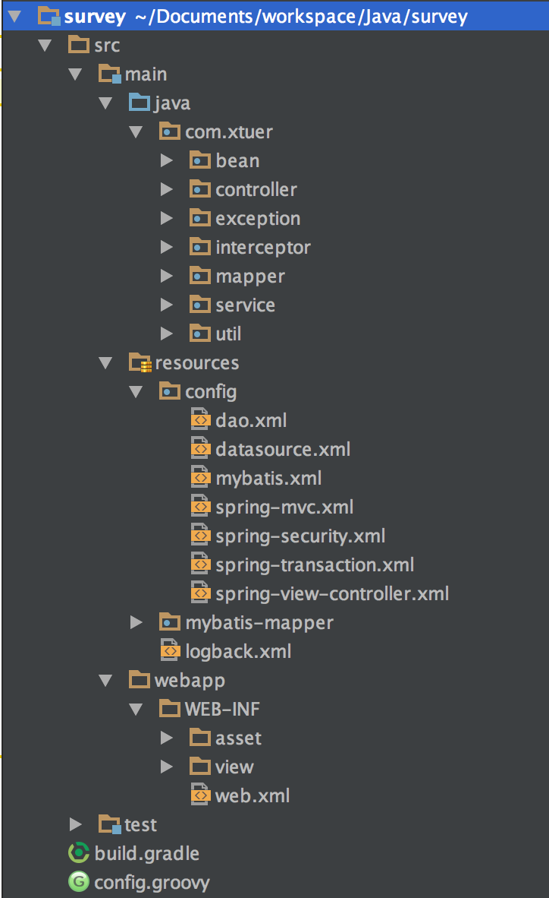

## 目录结构



| 目录                  | 说明                  |
| -------------------- | -------------------- | ------------ |
| main/java            | 存放类文件             |
| main/resources       | 其他需要放到 classpath 下的配置文件, 如 logback 的配置 |
| main/resources/config | 配置文件，例如 Spring MVC, Spring Security 等的配置文件 |
| main/resources/mybatis-mapper | MyBatis 的映射文件 |
| /WEB-INF/view/jsp    | JSP 模版              |
| /WEB-INF/view/freemarker | Freemarker 模版       |
| /WEB-INF/asset/js    | JavaScript 文件       |
| /WEB-INF/asset/css   | CSS 文件              |
| /WEB-INF/asset/image | image                |

## 文件说明
| 文件                  | 说明                  |
| -------------------- | -------------------- | ------------ |
| dao.xml              | 数据库访问的 Bean 的配置文件 |
| datasource.xml       | 数据源配置文件          |
| mybatis.xml          | MyBatis 配置文件       |
| spring-mvc.xml       | Spring MVC 配置文件    |
| web.xml              | Web 项目的配置文件      |

## 如何创建 Dao 访问数据库
以 Domain 对象 `Demo` (其实就是一个 POJO) 和其 Dao 为例:

1. 创建 Domain 对象的类到包 `com.xtuer.domain` 中

    ```
    Demo
    ```
2. 创建 Dao 的接口到包 `com.xtuer.dao` 中

    ```
    DemoDao
    ```
3. 创建 Dao 的实现在包 `com.xtuer.dao.mybatis` 中

    ```
    DemoDaoImpl
    ```
4. 由于是使用 MyBatis，需要创建 Mapper 接口到包 `com.xtuer.dao.mybatis.mapper` 中

    ```
    DemoMapper
    ```
5. 创建 Domain 对象需要使用的 MyBatis 的映射文件到目录 `main/resources/mybatis-mapper` 里

    ```
    Demo.xml
    ```
6. 在 dao.xml 里配置生成 Dao 对象

通过上面 6 步创建好 Dao，就可以在 Controller 和 Service 层使用 Dao 访问数据库了。抽象出 Dao 层为接口是为了以后例如数据库读写分离，历史数据分库等需要使用多个数据源时业务逻辑层的代码不受影响。如果直接在业务逻辑层使用 MyBatis 的 Mapper，目前是简单，但是以后如有变动，需要改的地方就很多，甚至给 Dao 添加缓存功能(从缓存服务器读取数据)都需要动很多代码。

## 如何创建 Controller
参考 `DemoController` 的实现

1. 在 `com.xtuer.controller.UriConstants` 里定义 URI 和 View Name 为常量字符串变量

    > URI 和 View Name 不要直接写在 Controller 里，而是使用常量定义在 UriConstants 中，这样便于集中管理和查看，否则项目里提供了多少 URL 都不知道
2. Controller 定义在包 `com.xtuer.controller` 里
3. 如果 Controller 需要模版文件来渲染结果

    * Freemarker 模版文件放在 `/WEB-INF/view/freemarker`
    * JSP 文件放在 `/WEB-INF/view/jsp`
4. 页面需要的静态文件: js, css, image 放在 `/WEB-INF/asset/[js|css|image]` 下面

## 测试数据
数据库表 `demo` 只有 2 个字段: id 和 message

```sql
CREATE TABLE `demo` (
  `id` int(11) NOT NULL,
  `message` text COLLATE utf8_unicode_ci NOT NULL
) ENGINE=InnoDB AUTO_INCREMENT=2 DEFAULT CHARSET=utf8 COLLATE=utf8_unicode_ci;
```

向表里插入一条记录

```sql
INSERT INTO `demo` (`id`, `message`) VALUES (1, 'This is used only for demonstration!');
```

> 数据库的名字，用户名，密码等参考 datasource.xml 中的配置，可自行修改

## 测试
1. 访问 <http://localhost:8080/demo>
2. 访问 <http://localhost:8080/demo/1>


